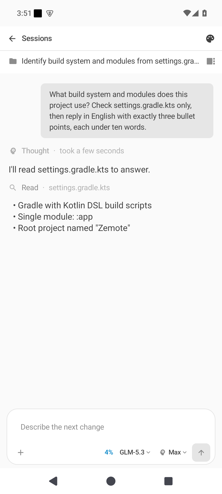
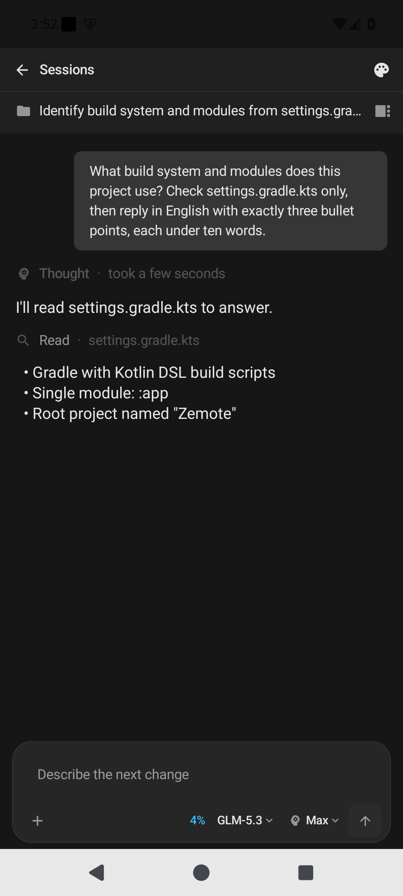

<div align="center">

<picture>
  <source media="(prefers-color-scheme: dark)" srcset="docs/assets/banner-dark.svg">
  
</picture>

**Your desktop ZCode, in your pocket.**

**[Releases](https://github.com/howyoungchen/ZCode-Android/releases)** ·
**[Live preview](https://howyoungchen.github.io/ZCode-Android/)** ·
**[简体中文](README_CN.md)**

Kotlin · Jetpack Compose · Material 3 · MIT

</div>

## Why Zemote?

A coding agent doesn't pause when you step away from your desk — but checking on it
from a phone has meant a browser tab wrestling a desktop layout on a six-inch
screen. Zemote is an unofficial, independent client that speaks the same protocol
as the official web remote, reimplemented natively in Kotlin: your sessions,
tool calls and approvals, all a thumb-reach away. It talks to nothing except the
official Relay, and collects nothing at all.

> [!IMPORTANT]
> **Unofficial project.** Zemote is a community-built third-party client with no
> affiliation with Z.ai or ZCode, and no official endorsement. The ZCode name and
> related trademarks belong to Z.ai. If anything in this project infringes your
> rights, please [open an issue](https://github.com/howyoungchen/ZCode-Android/issues)
> to contact us directly and it will be handled immediately.

<table>
  <tr>
    <td width="33%" align="center">
      <br>
      <b>Live conversation</b><br>
      <sub>Streaming reply with thinking rows, tool calls and Markdown</sub>
    </td>
    <td width="33%" align="center">
      <br>
      <b>Dark theme</b><br>
      <sub>The same monochrome design language, lights out</sub>
    </td>
    <td width="33%" align="center">
      <br>
      <b>Mission dashboard</b><br>
      <sub>Workspaces and tasks at a glance, live status, one-tap new task</sub>
    </td>
  </tr>
  <tr>
    <td width="33%" align="center">
      <br>
      <b>Instant pairing</b><br>
      <sub>Scan the desktop QR code or paste the link; keep several devices</sub>
    </td>
    <td width="33%" align="center">
      <br>
      <b>Dashboard at night</b><br>
      <sub>Everything readable in the dark, status pills included</sub>
    </td>
    <td width="33%" align="center">
      <br>
      <b>Settings</b><br>
      <sub>Theme, language, cache management and debug logs</sub>
    </td>
  </tr>
</table>

## Why this fork?

This repository forked from
[Damianjiang/ZCode-Android](https://github.com/Damianjiang/ZCode-Android), and
owes its protocol stack and architecture to the original author,
[Damian2012](https://github.com/Damianjiang).

The fork exists for one main reason: **make it look and feel like Z.ai actually
shipped it.** Monochrome surfaces, sky-blue accents, a dashboard and conversation
flow that mirror the official mobile remote page block for block — not just
"similar colors". Under the hood, protocol reliability is an ongoing focus:
cold-start session loading, streaming stalls and reconnect flows have all been
rebuilt (see the [Changelog](CHANGELOG.md)).

**Development continues here, independently, maintained by
[howyoungchen](https://github.com/howyoungchen).**

## What you get

| | |
|---|---|
| **Instant pairing** — scan the desktop QR or paste the link; keep several devices and switch in one tap | **Mission dashboard** — workspaces and their tasks at a glance, live status pills, one-tap new task |
| **Live conversations** — thinking, replies and tool calls stream in as they happen, with full Markdown and inline images | **Queued messages** — keep typing while it works; edit, reorder or drop queued messages before they go |
| **Approvals on the go** — grant file access and command execution, and kill runaway tasks, right from your phone | **Subagent views** — open any subagent's read-only session, jump back exactly where you left off |
| **Built to stay connected** — auto-reconnect with subscription recovery after network switches, plus a foreground keep-alive service | **Private by design** — credentials sealed in Android Keystore, zero telemetry, no endpoint beyond the official Relay |

## Getting started

1. **Desktop** — open ZCode → *Remote control* → generate the pairing QR code.
2. **Phone** — install Zemote and scan the code (or paste the link). Treat that
   link like a password: whoever holds it holds your machine.
3. **Talk** — pick a workspace, open a task session, and chat away; queue
   follow-ups, upload files, approve actions as they come.

Each release ships an APK on the
[Releases](https://github.com/howyoungchen/ZCode-Android/releases) page — or build
from source below. Requirements: Android 9+ (API 28), arm64-v8a. Curious how it
looks before installing? There's a
[live preview](https://howyoungchen.github.io/ZCode-Android/).

## How it works

Zemote is a pure client — one WebSocket to the official Relay, with the
reverse-engineered stack layered on top. Each layer mirrors the official web
client's behavior, implemented from scratch:

```
┌──────────────────────────────────────────────────────────────┐
│ Conversation V4    snapshots & deltas · streaming · queue ·   │
│                    attachments · permission requests          │
├──────────────────────────────────────────────────────────────┤
│ Channel RPC        request/response promises + events         │
├──────────────────────────────────────────────────────────────┤
│ rpc-frame          512KB fragments · CRC32 · acks · resend    │
├──────────────────────────────────────────────────────────────┤
│ IPC codec          7-bit varint (String/Int/JSON/Bytes/Array) │
├──────────────────────────────────────────────────────────────┤
│ Pairing            HMAC-SHA256 proof                          │
├──────────────────────────────────────────────────────────────┤
│ Relay              wss · 10s heartbeat · backoff reconnect    │
└──────────────────────────────────────────────────────────────┘
                              ⇅
                     Official Relay ⇄ Desktop ZCode
```

The wire format is documented field by field in the
[protocol spec](docs/protocol.md) (Chinese).

## Build from source

You need JDK 17 and Android SDK 35.

```bash
git clone https://github.com/howyoungchen/ZCode-Android.git
cd ZCode-Android
./gradlew assembleRelease   # gradlew.bat on Windows
```

The APK lands in `app/build/outputs/apk/release/` — R8-shrunk, resource-shrunk
and debug-signed, ready to sideload. Use `assembleDebug` while hacking.

## FAQ

**Is this an official app?**
No. Zemote is unofficial and unaffiliated with ZCode or Z.ai. The protocol was
reverse-engineered from the official web remote, so an official update can break
it at any time — when that happens, the stack gets re-diffed against the new
official client and updated.

**Is my pairing link safe to share?**
Never share it. The `sid` / `hash` inside the link are equivalent to full control
of your desktop ZCode. If one leaks, regenerate the QR code on the desktop and
the old credentials are dead.

**What data does it collect?**
None. No telemetry, no third-party endpoints — only the official Relay.
Credentials are encrypted with Android Keystore (AES/GCM) and never leave the
phone.

**Which devices does it run on?**
Android 9+ (API 28), arm64-v8a only. Both light and dark themes, 中文 and
English UI.

**Something broke. Where do I report it?**
[GitHub Issues](https://github.com/howyoungchen/ZCode-Android/issues). The
in-app debug log (Settings → Debug) records every protocol exchange and copies
in one tap — attach it to your report.

## Project layout

Single Gradle module, pure client:

```
app/src/main/java/app/zemote/
├── protocol/    # the reverse-engineered stack: relay → pairing → IPC → rpc-frame → conversation
├── state/       # devices, encrypted credentials, connection & session state
├── ui/          # Compose screens, theme, shared components
├── service/     # foreground keep-alive service
└── crash/       # crash capture and reporting
```

## Documentation

Written in Chinese, living under `docs/`:

- [architecture.md](docs/architecture.md) — how the app is put together
- [protocol.md](docs/protocol.md) — the wire protocol, field by field
- [data-model.md](docs/data-model.md) — what lives on disk
- [runbook.md](docs/runbook.md) — build, release and troubleshooting
- [adr/](docs/adr/README.md) — why things are the way they are
- [CHANGELOG.md](CHANGELOG.md) — what changed in each release

## Community

- [GitHub Issues](https://github.com/howyoungchen/ZCode-Android/issues) — bug reports, feature requests and discussions

## Acknowledgments

- [Damianjiang/ZCode-Android](https://github.com/Damianjiang/ZCode-Android) by
  [Damian2012](https://github.com/Damianjiang) — the protocol reverse engineering
  and architecture this fork stands on; the conversation protocol cross-references
  that project's earlier Flutter version (same wire behavior).
- AI (LLM) assistance was used for parts of the original codebase; the overall
  architecture and core protocol were the original author's own work, and AI
  output was human-reviewed before inclusion.

## License

MIT. ZCode and Z.ai are trademarks of their respective owners; this project is
not affiliated with them.
