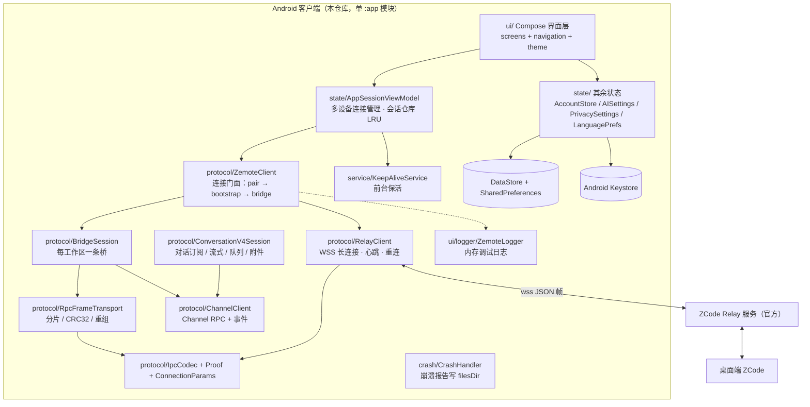
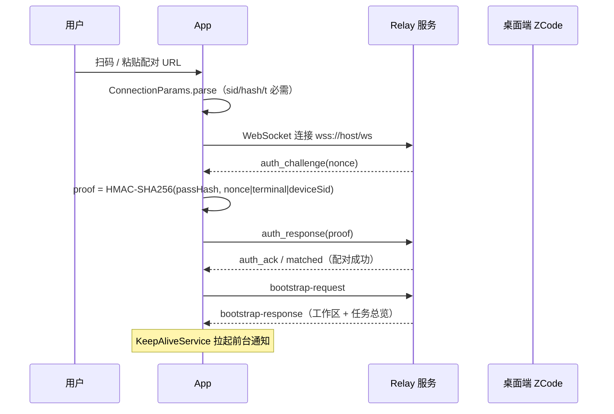
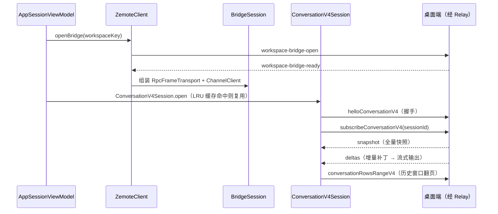
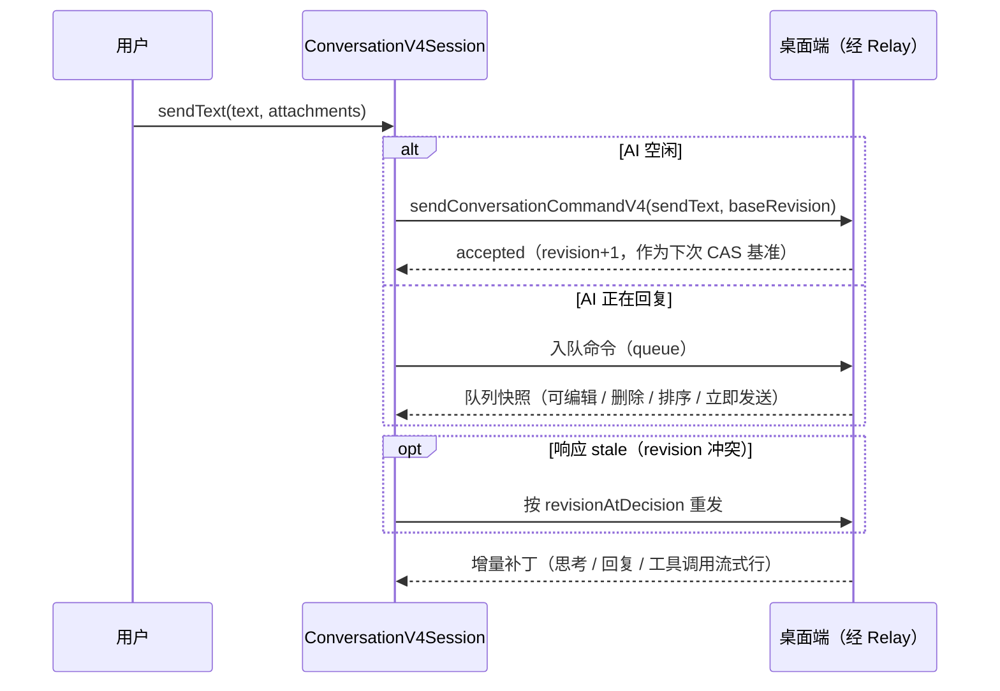

# 架构文档

> 最后更新：2026-10-07 ｜ 维护规则：模块增删、依赖变化时同步更新

## 1. 项目概览

Zemote（仓库名 ZCode-Android）是一个**非官方**的 Android 端 ZCode 远程控制客户端：
通过逆向官方 Web 远程控制页面的通信协议，让用户在手机上查看和操控**自己桌面端**
ZCode 的工作区、任务与对话会话，不依赖浏览器（见 README.md）。

- 定位：纯客户端应用，仓库内没有任何服务端代码。
- 用户：拥有桌面端 ZCode 的个人用户（配对 URL / 二维码由桌面端生成）。
- 唯一的网络对端是 ZCode 官方 Relay 服务（地址来自配对 URL 的 host）。

## 2. 技术栈

来源：`gradle/libs.versions.toml`、`app/build.gradle.kts`。

| 层次 | 技术 | 版本 | 说明 |
|---|---|---|---|
| 语言 / 构建 | Kotlin | 2.1.0 | AGP 8.7.3，JDK 17 |
| UI | Jetpack Compose（BOM） | 2024.12.01 | Material 3，Navigation Compose 2.8.5 |
| 网络 | OkHttp | 4.12.0 | 仅用于 WebSocket 长连接（RelayClient） |
| 序列化 | Gson | 2.12.1 | Relay JSON 帧与 IPC JSON 值 |
| 持久化 | DataStore Preferences | 1.1.1 | 设备列表 + 主题（见 data-model.md） |
| 持久化 | SharedPreferences | — | 设置/AI/隐私/语言四组键（见 data-model.md） |
| 加密 | Android Keystore | — | AES-256/GCM 设备凭据加密（CredentialCipher） |
| 相机 / 扫码 | CameraX + ZXing | 1.3.4 / 3.5.3 | 配对二维码扫描与解析 |
| 图片加载 | Coil Compose | 2.5.0 | 消息内联图片 |
| SDK 约束 | compile/targetSdk 35，minSdk 28 | — | 仅打包 arm64-v8a；资源只保留 zh / en；动态取色需 Android 12+ |

应用标识：`applicationId app.zemote`，versionCode 24 / versionName 1.9.3（app/build.gradle.kts）。

## 3. 系统架构图

## 4. 模块说明

全部代码在单模块 `:app` 内，按包分层（`app/src/main/java/app/zemote/`）。

### 4.1 `protocol/` — 协议栈（核心，全部独立实现）

自底向上的分层（每个文件即一层）：

| 文件 | 职责 |
|---|---|
| `ConnectionParams.kt` | 解析配对 URL（`sid`/`hash`/`t` 必需），推导 Relay WSS 地址 `wss://host/ws?mid=` |
| `Proof.kt`（含 `Crc32`） | 配对证明 `HMAC-SHA256(passHash, "$nonce\|$role\|$deviceSid")`，base64url 无填充；IEEE CRC-32 |
| `IpcCodec.kt` | IPC 值编解码：类型标签 0-6（null/String/Bytes/VSBuffer/Array/JSON/Int），7-bit varint 长度；纯 JVM、无 Android API |
| `RpcFrameTransport.kt` | 逻辑消息分片：512KB/片、最多 64 片（消息 ≤16MB）、CRC32 校验、`rpc-frame`/`rpc-frame-ack` 收发 |
| `ChannelClient.kt` | Channel RPC：请求-应答 promise（类型码 100-103 / 200-204）+ 事件监听；十个通道（FILE/SYSTEM/TERMINAL/GIT/GIT_CHECKPOINT/SETTING/CREDENTIAL/ZCODE_AGENT/ZCODE_SESSION/ZCODE_TASK） |
| `RelayClient.kt` | OkHttp WebSocket 长连接：`auth_init → auth_challenge → auth_response → matched` 配对；10s 心跳（ack 超时 30s、死链阈值 25s）；指数退避重连（1s→15s 封顶）；被踢（kicked）后 1s→8s 退避抢回 |
| `ZemoteClient.kt` | 连接门面：`connect → waitPaired → bootstrap（工作区/任务总览）→ openBridge`；按 payload 匹配器的请求-响应 |
| `BridgeSession.kt` | 一条工作区桥 = transport + channels 组合；`swapBridge` 支持恢复期换桥重建 |
| `ConversationV4.kt`（约 2000 行） | 对话协议 V4：`helloConversationV4` 握手、`subscribeConversationV4` 订阅（快照 + 增量补丁）、`sendConversationCommandV4`（带 `baseRevision` CAS 与 stale 重试）、`conversationRowsRangeV4` 历史翻页、附件 `attachmentPutV4/CommitV4/ReadV4`、sessions-index 实时订阅、看门狗 resync |

- 入口：`ZemoteClient`；被 `state/AppSessionViewModel` 调用。
- 依赖：仅 OkHttp / Gson / Kotlin 协程，不依赖任何 UI 类（ZemoteLogger 除外，用于打日志）。
- 每层的消息名、字段与常量的逐层规范见 [protocol.md](./protocol.md)。

### 4.2 `state/` — 状态与持久化

| 文件 | 职责 |
|---|---|
| `AppSessionViewModel.kt` | 多设备连接管理；每账号 LRU 最多缓存 8 个 `ConversationV4Session`（同一工作区共享一条 bridge）；连接成功后拉起 `KeepAliveService` |
| `AccountStore.kt` | 设备列表仓库：DataStore 单键 `accounts` 存 JSON，URL 经 Keystore 加密后落盘 |
| `CredentialCipher.kt` | Keystore（别名 `zemote_key`）AES-256/GCM 加解密，`enc:` 前缀区分密文 |
| `AppSettings.kt` / `AISettings.kt` / `PrivacySettings.kt` / `LanguagePrefs.kt` | 四组 SharedPreferences 设置（明细见 data-model.md） |

### 4.3 `ui/` — Compose 界面

- `navigation/ZemoteNavHost.kt`：全部路由。参数化路由：`main_shell/{accountId}`、`chat/{workspaceKey}/{sessionId}`、`subagent/{workspaceKey}/{childSessionId}/{parentSessionId}`；静态路由：`main`、`qr_scan`、`personalize`、`ai_settings`、`feedback`、`changelog`、`log`、`cache_clean`。
- `screens/`：主链路 Main（设备/设置双 Tab）→ QrScan → MainShell（官方远控仪表盘）→ Chat；辅助页含崩溃报告（CrashScreen）、调试日志（LogScreen）、缓存清理（CacheCleanScreen）等。
- `theme/`：M3 主题；`ThemeManager` 经 DataStore 持久化模式 / 色盘。色板对齐官方 ZCode 远控页（zai 黑白单色 + sky 点缀，令牌提取自官方 CSS），动态取色已移除。
- 界面按官方移动端远控页（`webRemoteControl.mobileHome` / `mobileShell`，结构提取自官方 v4 构建产物）逐块对齐：
  MainShell 为仪表盘（大标题头 + 提示卡 + 可展开的工作区卡片，卡片内嵌任务列表与状态胶囊，
  「+」直达新建会话，任务行直达会话，原独立 Tasks 会话列表页已删除）；
  Chat 为文档流时间线（助手正文 16sp 通栏、用户右对齐 `secondary` 气泡、
  思考行「思考 · 持续了 N 秒」、工具行单行摘要可展开）+ 官方 composer
  （占位文案 / 模型胶囊 / 推理强度胶囊 / 黑色圆角方块停止与发送键）。
- `components/Markdown.kt`：消息 Markdown 渲染（正文 16sp，对齐官方 text-ui-lg）。

### 4.4 支撑组件

- `service/KeepAliveService.kt`：前台服务（`dataSync` 类型），连接期间常驻低优先级通知；进程被杀后以 null intent 重启时自停。
- `crash/CrashHandler.kt`：全局未捕获异常写入 `filesDir/crash_report.txt`，下次启动进崩溃页。
- `ui/logger/ZemoteLogger.kt`：进程内环形缓冲（1000 条、单条截断 4000 字符、300ms 节流发布），设置页可开关与清空。
- 入口链：`ZemoteApp`（装 CrashHandler、初始化 AISettings）→ `MainActivity`（语言包装、DataStore 装配、崩溃页分流）→ `ZemoteNavHost`。

## 5. 关键流程

### 5.1 配对与连接（扫码 → bootstrap）

配对成功后心跳 10s 一次；断线按 1s→15s 指数退避重连（RelayClient.kt）。

### 5.2 打开工作区会话（单桥多订阅）

### 5.3 发送消息（CAS + 排队）

## 6. 外部依赖

| 依赖 | 用途 | 失效影响 |
|---|---|---|
| ZCode Relay 服务（配对 URL 中的 host） | 唯一通信信道：配对、bootstrap、bridge、对话流 | 全部功能不可用；协议不兼容时需逆向跟进（README 免责声明已声明该风险） |
| GitHub Pages（CI 自动部署 `docs/`） | 产品落地页（docs/index.html） | 仅影响下载页，App 功能不受影响 |
| GitHub 仓库页 | 反馈入口（浏览器 Intent 打开，App 自身不调 API） | 无功能影响 |

App 不上报遥测、不请求其它第三方接口（`usesCleartextTraffic=false`）。

## 7. 相关决策

见 [adr/README.md](./adr/README.md)：0001（协议逆向独立实现）、0002（由 Flutter 迁移至 Compose）、0003（凭据 Keystore 加密）、0004（单桥多订阅 + LRU）、0005（纯 JVM 编解码 + 脚本验证）、0006（release 用 debug 签名分发）。
