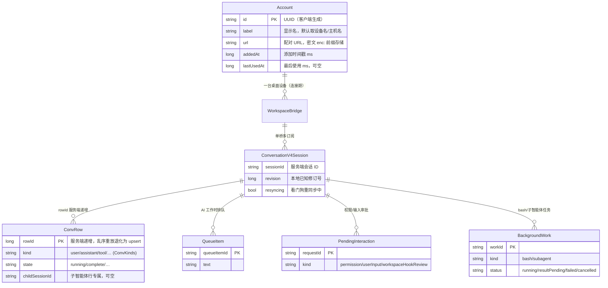

# 数据模型

> 最后更新：2026-10-07 ｜ 维护规则：schema 迁移合入时同步更新

本项目是纯客户端应用，**没有服务端数据库**。所有数据分两类：

1. **本地持久化**（DataStore / SharedPreferences / Keystore / 普通文件）；
2. **运行时内存态**（会话、消息行、队列——来源为桌面端推送，不落盘）。

## 1. 存储选型概览

| 存储 | 位置 | 承担职责 | 来源 |
|---|---|---|---|
| DataStore Preferences | `filesDir/datastore/zemote_settings.preferences_pb` | 设备列表（`accounts`）+ 主题三项 | MainActivity.kt:23、ThemeManager.kt |
| SharedPreferences | `shared_prefs/*.xml` ×4 | 通用设置 / AI 设置 / 隐私 / 语言 | 各 state/*.kt |
| Android Keystore | 系统密钥库，别名 `zemote_key` | AES-256/GCM 加密设备凭据 | CredentialCipher.kt |
| 普通文件 | `filesDir/crash_report.txt` | 上次崩溃报告 | CrashHandler.kt |
| cacheDir | 系统缓存目录 | 可随时丢弃的缓存 | CacheCleanScreen.kt |

注意一个易混淆点：DataStore 文件名与 AppSettings 的 SharedPreferences 文件**同名**（都是 `zemote_settings`），但物理上是两个文件（`.preferences_pb` vs `.xml`）。

## 2. 实体关系图

持久化实体只有 `Account`；其余为运行时对象（每次连接重建，不落盘）：

会话仓库按 `accountId|workspaceKey` 缓存在 `AppSessionViewModel` 的 LRU 中，每账号上限 8 个，超出淘汰最久未用的（dispose 会关闭对应 bridge）。

## 3. 持久化明细

### 3.1 DataStore：`accounts` 键（AccountStore.kt）

单键存整个 JSON 数组，读取时逐条解密 URL：

| 字段 | 类型 | 说明 |
|---|---|---|
| id | String | UUID |
| label | String | 显示名 |
| url | String | **落盘为密文**：`enc:` + base64url(IV(12B) + AES-GCM 密文)；历史明文数据兼容读取 |
| addedAt | Long | 添加时间 ms |
| lastUsedAt | Long? | 最后使用 ms |

写入方 / 读取方：均为 `AccountStore`（UI 经 ViewModel 间接调用）。
一致性规则：先更新内存 StateFlow 再异步持久化；读取时密钥丢失（解密失败）的条目**静默跳过**。
另有 `exportJson()` / `importJson()`（含明文凭据的备份格式，`format=devices, version=1`），当前无 UI 入口（见 ⚠️ 待确认）。

### 3.2 DataStore：主题键（ThemeManager.kt）

| 键 | 类型 | 默认值 | 说明 |
|---|---|---|---|
| theme_mode | String | FOLLOW_SYSTEM | LIGHT / DARK / FOLLOW_SYSTEM |
| dynamic_color | Boolean | false | 遗留键：动态取色已随 zai 主题重构移除，UI 不再展示与生效 |
| theme_palette | String | "zai" | 品牌色盘（现仅官方「zai」黑白单色盘；旧值 iris/blue/… 回退到 zai） |

### 3.3 SharedPreferences（4 个文件）

| 文件 | 键 | 类型 / 取值 | 默认值 | 写入方 |
|---|---|---|---|---|
| `zemote_settings.xml` | max_messages | Int，50..1000（越界截断） | 100 | SettingsScreen |
| `zemote_ai_settings.xml` | model_provider | bigmodel / zcode | bigmodel | AISettingsScreen |
| | model_id | String | "" | AISettingsScreen |
| | thought_level | auto / light / deep | auto | AISettingsScreen |
| `zemote_privacy_settings.xml` | optimize_agent_experience | Boolean | true | PrivacySettings（对应官方 Web 同名开关） |
| `zemote_lang.xml` | lang | system / zh / en | system | 设置页；`attachBaseContext` 阶段同步读取 |

### 3.4 Android Keystore（CredentialCipher.kt）

- 别名 `zemote_key`，AES-256 / GCM / NoPadding，仅加解密用途。
- 密文格式：`enc:` + base64url( 12 字节 IV + 密文 )，GCM tag 128 位。
- Keystore 不可用时：加密返回 null，上层**降级明文存储**；解密失败（密钥丢失）时该账号被跳过。
- 前缀 `enc:` 是密文与历史明文的判别依据（`isEncrypted()`）。

### 3.5 普通文件

| 文件 | 内容 | 生命周期 |
|---|---|---|
| `filesDir/crash_report.txt` | 崩溃时间/版本/设备/线程 + 完整堆栈（含 cause 链） | 下次启动展示后可清（CrashScreen 重启即清） |
| `cacheDir/**` | 应用缓存 | CacheCleanScreen 扫描并可清 |

## 4. 运行时数据（内存态，供改协议时参考）

定义集中在 `ConversationV4.kt` 头部：

- `SessionEntry`：sessions-index 推送的会话条目（phase 决定 running）。
- `ConvRow`：对话时间线行；`row.appended` 对乱序/重放（`rowId <= 末行`）退化为 upsert，避免重复 key。
- `QueueItem` / `PendingInteraction`（含 `InteractionOption`）/ `BackgroundWork` / `TaskEntry` / `AttachmentData`。

## 5. 数据生命周期与备份

- **云备份**：`data_extraction_rules.xml` 仅 include `sharedpref` 域 → DataStore（设备列表）**不在**云备份范围内；`backup_rules.xml`（API<31 路径）内容为 `<resources>` 根节点，非标准 `<full-backup-content>` 格式（⚠️ 待确认是否有意为之）。
- 设备列表的唯一可靠备份途径是 `AccountStore.exportJson()`，但当前无 UI 入口。
- 调试日志（ZemoteLogger）为进程内存环形缓冲：1000 条封顶、单条 4000 字符截断，进程退出即消失。
- **禁止清空 `filesDir`**：DataStore 文件在 `filesDir/datastore/` 下，清掉即丢失全部已配对设备（CacheCleanScreen.kt 内有显式警告注释）。

## 6. 危险操作红名单

| 操作 | 后果 |
|---|---|
| 直接删除/编辑 `files/datastore/zemote_settings.preferences_pb` | 丢失全部已配对设备与主题设置 |
| 在「缓存清理」页加入"清空 filesDir"类项目 | 同上（代码注释已明令禁止） |
| 导出的 `exportJson` 内容外发 | 含明文 `sid`/`hash` 凭据，等同交出设备控制权 |
