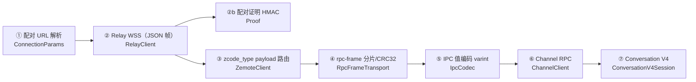

# ZCode 远程控制协议接口文档

> 最后更新：2026-10-07 ｜ 维护规则：改动 `app/src/main/java/app/zemote/protocol/` 下任何文件时同步更新本文
>
> **事实来源是代码**：所有消息名、字段、常量以 `protocol/` 目录实现为准；
> 官方 Web 客户端 JS 对照材料在 `analysis/official/`、`zcode_downloaded/`、根目录 `bundle.js`。
> 本协议系逆向所得，官方无任何稳定性承诺（见 [adr/0001](./adr/0001-reverse-engineered-protocol.md)）。

## 0. 分层总览



上层依赖下层；②③ 是 JSON 文本，④⑤ 之后是二进制帧（经 ② 的 data 帧承载）。

## 1. 配对 URL（ConnectionParams.kt）

桌面端生成的远程控制 URL，格式 `https://host[:port]/...?sid=...&hash=...&t=...`：

| 参数 | 必需 | 说明 |
|---|---|---|
| sid | ✔ | 设备 SID（桌面端身份） |
| hash | ✔ | 配对口令哈希（HMAC 密钥素材，等同凭据） |
| t | ✔ | 时间戳，10 位秒或 13 位毫秒均可 |
| mid / name / app_version | ✖ | 设备 MID / 设备名 / 桌面端版本 |

scheme 仅接受 https / wss。Relay 地址由 URL 推导：`wss://<host>[:<port>]/ws[?mid=<encoded>]`。

## 2. Relay 层：WebSocket JSON 帧（RelayClient.kt）

每帧是一个 JSON 对象，以 `type` 字段区分。App 以 **role = "terminal"** 身份接入。

**客户端 → 服务端：**

| type | 字段 | 说明 |
|---|---|---|
| auth_init | role:"terminal", device_sid, meta{platform:"android", version, name:"Zemote"}, client_ts | 连接建立后立即发送 |
| auth_response | device_sid, proof, client_ts | 应答 auth_challenge，proof 见 §3 |
| pair_status_query | device_sid, client_ts | 心跳探测（配对前后均用） |
| data | payload, client_ts | 承载上层 zcode_type payload（§4） |

**服务端 → 客户端：**

| type | 字段 | 说明 |
|---|---|---|
| auth_challenge | nonce | 质询 |
| auth_ack / pair_status_ack | pair_status | pair_status="waiting"：等桌面端确认（从未配对时 30s 超时报 invalid-mobile-connection；重配对卡 waiting 20s 则重连） |
| matched | — | 配对成功 → 启动心跳、冲刷出站队列 |
| error | code, message | code="KICKED"（被其它客户端抢占）→ 关闭后按 1s→2s→4s→8s 退避抢回 |

**心跳与断线**：每 10s 发 pair_status_query，ack 超过 30s 先探测再重连；静默 25s 判死链（poke）。意外断线（onClosed 与 onFailure 均算）按 1s→2s→4s→8s→16s（封顶 15s）指数退避重连；从未配对成功的 onFailure 不自动重连，置 ERROR 交由 UI 提示重试。

**WebSocket 关闭码映射**：4004 session-not-found、4009 session-conflict、4010 desktop-disconnected（触发重连）、4011 session-expired、4012 workspace-closed、4013 invalid-mobile-connection。

## 3. 配对证明（Proof.kt）

```
proof = base64url_nopad( HMAC-SHA256( key = utf8(passHash),
                                      msg = utf8("$nonce|$role|$deviceSid") ) )   // role="terminal"
```

与官方 Web 客户端的 `aen()/ien()` 一致。CRC32 用 IEEE 多项式（RpcFrameTransport 校验用）。

## 4. zcode_type payload 路由（ZemoteClient.kt）

上层业务 payload 装在 ② 的 data 帧里，按 `zcode_type` 路由。
**注意：响应不保证回带 requestId**——客户端对每个在途请求跑一遍匹配谓词（对齐官方 `k()` 模式）。

| zcode_type | 方向 | 关键字段 / 应答 | 说明 |
|---|---|---|---|
| bootstrap-request → bootstrap-response | 请求 | — | 工作区 + 任务总览 |
| workspace-list-request → workspace-list-response | 请求 | — | 工作区列表 |
| workspace-list-updated | 推送 | result | 工作区变化通知 |
| workspace-reconnect-request → workspace-reconnect-response | 请求 | workspaceKey | 重连工作区 |
| workspace-bridge-open → workspace-bridge-ready / -error | 请求 | requestId, bridgeSessionId, bridgeGeneration, workspaceKey, taskId?；恢复时带 recoveryId | 开桥（按 bridgeSessionId 匹配应答） |
| bridge-degraded | 推送 | bridgeSessionId, reason | 桥降级 → 自动 reopen 恢复 |
| mobile-view-state-update | 推送 | viewState{activeWorkspaceKey, activeTaskId?, updatedAt}, deviceInfo | 上报当前视图（对齐官方 `N()`） |
| rpc-frame / rpc-frame-ack | 双向 | 见 §5 | 按 bridgeSessionId 路由到对应桥 |

## 5. rpc-frame 分片（RpcFrameTransport.kt）

一条逻辑 IPC 消息切片传输，字段：

| 字段 | 说明 |
|---|---|
| bridgeSessionId / bridgeGeneration / recoveryId | 桥身份（继承自开桥应答） |
| seq / messageSeq | 片序号 / 消息序号 |
| fragmentIndex / fragmentCount / messageBytes | 分片索引 / 总数 / 整消息字节数 |
| checksum | {algorithm:"crc32", value: 8 位 hex}（对整消息计算） |
| dataBase64 | 分片内容 |

限制：**512KB/片、最多 64 片、整消息 ≤16MB**。收到 rpc-frame-ack 做流控应答；重组完成后按 CRC32 校验再上交 ChannelClient。

**可靠发送（对齐官方 l2t 传输层）**：出站帧保留在 ≤8MB 重放缓冲直到桌面端 `rpc-frame-ack(ackMessageSeq)` 确认；relay 重新配对后未确认消息整体重发（桌面端按重放/duplicate 容忍）。发送返回 false（链路断开）时游标停在当前帧等恢复。入站完整消息的 ack 队列化补发（丢失 ack 会让桌面端 45s 后判 replayGraceExceeded 降级桥）。计数器与发送在锁内进行，杜绝并发下的 seq/messageSeq 重复。桌面端侧的对应判定：`physicalGap`（漏收我方帧）、`replayGraceExceeded`（我方 ack 未达）。

## 6. IPC 值编码（IpcCodec.kt）

二进制值编码，长度/计数一律 **7-bit 小端 varint**：

| tag | 类型 | 编码 |
|---|---|---|
| 0 | null | 1 字节 |
| 1 | String | varint 长度 + UTF-8 |
| 2 / 3 | Buffer / VSBuffer | varint 长度 + 原始字节（Kotlin ByteArray → tag 3） |
| 4 | Array | varint 个数 + 逐元素递归 |
| 5 | JSON 对象 / Long | varint 长度 + JSON 字符串（Long 编为带引号数字串） |
| 6 | Int（0..2³¹-1） | varint |

解码防护：单值 ≤16MB、容器 ≤100,000 项。消息布局 = **头部 value-list `[type, id]` + data 值**；服务端下发帧含 13 字节帧头（RpcFrameTransport 注释）。本文件是热路径，改动须遵守文件头性能约定并跑 `tools/verify-ipc-codec/run.sh`。

## 7. Channel RPC（ChannelClient.kt）

| 码 | 含义 | | 码 | 含义 |
|---|---|---|---|---|
| 100 | 请求 promise | | 200 | Initialize（就绪标志） |
| 101 | 取消 promise | | 201 / 202 / 203 | promise 成功 / 错误 / 错误对象 |
| 102 | 监听事件 | | 204 | 事件触发 |
| 103 | 注销事件 | | | |

请求帧：`[100, reqId, channelName, method]` + `args`（两个相邻编码值）。
通道：`file` `system` `terminal` `git` `git-checkpoint` `setting` `credential` `zcode-agent` `zcode-session` `zcode-task`。
开桥后须等到 Initialize（200）才能调用（30s 超时）；请求默认 30s 超时。通道栈被整体替换（swapBridge）时，在途 promise 立即取消，不等各自超时。

## 8. Conversation V4（ConversationV4.kt，通道 zcode-agent）

### 8.1 握手（每桥一次）

1. `helloConversationV4()` → `{connectionId, clientMode}`。
2. `initializeConversationV4([{kind:"clientHello", protocolVersion:3, clientId, clientKind, appVersion:"unknown", capabilities:{workspaceHookReviewUi:true}}])`。
   clientKind 由 clientMode 推导：`"desktop-continuous"→"desktop"`，否则 `"web"`。
   （常量 `PROTOCOL_APP_VERSION="3.6.5"` 已定义但当前未引用——注释说明发 App 自身版本号会导致能力协商失败。）
   握手带互斥锁：openConversation / openSessionsIndex / sendCommand 并发进入时串行完成；
   未握手的连接上发订阅会被桌面端直接拒绝（promise 错误）。

### 8.2 订阅与事件流

- `subscribeConversationV4(scope + {sessionId})`（45s 超时，失败重试一次）→ `{ack:{subscriptionId, logEpoch}}`；同时监听通道事件 **`onDynamicConversationFrame`**（arg=scope）。应答前到达的帧先暂存、ack 后按序回放。
- `subscribeSessionsIndexV4(scope + {runtimePolicy:"existing-only"})` → ack；监听 **`onDynamicSessionsIndexFrame`**。
- `unsubscribeConversationV4(scope + {subscriptionId})`。
- **scope** 只带两字段：`{workspacePath, workspaceIdentity}`（多余字段可能干扰服务端校验）。

**wire 帧**（事件载荷）：`{topic:"conversation/…"|"sessions-index/…", kind:"complete"(内嵌 frame)|"fragment"}`；fragment 带 `logicalFrameId / fragmentIndex / fragmentCount(≤64) / dataBase64`，base64 分片拼接为 UTF-8 JSON（碎片 TTL 60s）。

**逻辑帧**：`{subscriptionId, fromSeq?, toSeq, payload}`，`payload.kind`：

- `snapshot`：全量快照（rows 窗口、config、usage、queue、control、revision、logEpoch）。
- `deltas`：**toSeq ≤ 本地 seq 的迟到帧直接跳过**（快照/resync 后仍在途的旧帧，官方 v4-store 同语义）；fromSeq 与本地 seq 不符（且非迟到）→ 断层，强制 resync；否则按序应用。

**delta op 清单**：会话 `row.appended` / `row.upserted` / `row.removed` / `row.delta`（流式追加，60ms 批量提交）/ `state.updated`（config/usage/queue 等补丁）；会话列表 `session.upserted` / `session.removed`。

**行结构（rows[]）**：公共字段 `{rowId:number, turnId, entityId?, createdAt, actions?{canFork, canEdit, canRetry, canRewindFiles}}`。`turnHeader`（回合头）带 `{state:"running"|"completedSuccess"|"completedInterrupted"|"failed", startedAt, endedAt?, activeMs?|durationMs?, fileChanges?{additions, deletions, files, state:"active"|"reverted"}}`——官方「已工作 N 分 M 秒」行与「N 个文件已更改 +a -d / 撤销」都取自这一行，不能在解析时丢弃；`assistantText` 带 `feedback:"like"|"dislike"?`（用户反馈回显）；`reasoning` 带 `durationMs?`（思考行耗时）。

### 8.3 命令信封与 CAS

所有命令经 `sendConversationCommandV4(scope + {envelope})`：

```
envelope = { commandId:uuid, clientId, sessionId, baseRevision?, type, payload, issuedAt }
```

`sessionId` **必填、可空**（官方 schema `Ji().nullable()`）：有会话命令带目标会话 id；
无会话命令（createSession 等）传 `null`，但**不可省略键**——省略会被桌面端 Zod 以
invalid_type 拒绝（`expected string, received undefined`）。null 值必须真实上线：
编码层要保留 null 键（官方 JSON.stringify 语义，Gson 需 serializeNulls）。

应答：`{status: accepted|duplicate|noop|stale, revisionAtDecision}`；`stale` 时以服务端 revision 重发一次；accepted/noop/duplicate 将本地基准推进到 revision+1。**必须携带 baseRevision 的命令（CAS_COMMANDS）**：applyFileRewind、forkAssistant、editUserQuery、retryTurn、setAssistantFeedback、sendQueuedNow、editQueueItem、reorderQueueItem、deleteQueueItem、setAutoDrain、switchModelConfig、switchCollaborationMode、setFollowupMode、pauseGoal、resumeGoal。

### 8.4 命令清单（type + payload）

| type | payload | 说明 |
|---|---|---|
| sendText | {text, requestedDelivery:"startNow"\|"queue", attachments?} | 首发消息走 createSession；遇 reasonCode `guard.heldQueueConfirmationStale` 需带 `heldQueueDisposition:"keepQueueAndSend"` + `expectedHeldQueueItemIds` 重试 |
| createSession | {workspaceId, firstInput:{text, attachments?}} | 新建会话（可含首发，不带 requestedDelivery） |
| stop | {} | 停止当前生成 |
| resolveInteraction | {interactionId, answer:{optionId \| freeText \| action}} | 权限审批 / 用户输入 / 计划确认 |
| cancel | {workId} | 取消后台任务（bash / 子智能体） |
| switchModelConfig | {provider, model, thought} | 报 "Unsupported reasoning effort" 时按另一家族档位重试 |
| sendQueuedNow / editQueueItem / deleteQueueItem | {queueItemId…} | 队列操作（edit 另带 newText） |
| reorderQueueItem | {queueItemIds: 完整有序列表} | 队列排序 |
| setAutoDrain | {autoDrain: Boolean} | 队列自动发送开关 |
| setAssistantFeedback | {target:{rowId, entityId}, feedback:"like"\|"dislike"\|null} | 消息赞/踩反馈，null 清除 |
| forkAssistant | {target:{rowId, entityId}} | 以该消息为起点分叉会话 |
| applyFileRewind | {target:{rowId, entityId}} | 撤销该回合的文件更改 |
| editUserQuery | {target:{rowId, entityId}, newText} | 编辑用户消息并重跑 |
| retryTurn | {target:{rowId, entityId}} | 重跑该回合 |

`target.rowId` 与 `beforeRowId` 一样**必须是 number**（官方 Zod 校验）。

**文件更改与撤销**：`conversationFileChangesV4(scope + {sessionId, target, baseRevision, baseLogEpoch})`
→ `{files, additions, deletions, items:[{path, additions, deletions}]}`（「N 个文件已更改」展开明细）；
`conversationFileRewindPreviewV4(同参)` → `{canApply, safeFiles[], unsafeFiles[], ignoredFiles[]}`
（撤销前安全预检，条目 `{path, operationCount, reason?}`）；真正撤销仍走命令 `applyFileRewind`。

**Git 通道（方法名即 RPC 名，首个参数 `{workspacePath, workspaceIdentity?}`）**：
`getRepositorySummary`（分支/脏状态）、`getLocalBranches`、`switchBranch({targetBranchName})`、
`getChanges({sourceId:"unstaged"|"staged"})`、`stagePaths({paths})`、`commit({message, paths?, stagedOnly?})`、
`push`、`getIdentity`。状态侧栏「Git 工具」节的数据源。

**任务列表通道（zcode-task）**：`setTaskPinned({taskId, pinned})`、`archiveTask({taskId})`、
`setTaskUnread({taskId, unread})`（任务「更多」菜单的置顶/归档/标记未读）。

**额度（usage-stats 通道）**：`getEntitlementSnapshot({includeSubscription, preferredProviderId, …})`
→ `{quota:{limits:[{type:"TOKENS_LIMIT"|"TIME_LIMIT", unit, number, percentage?, remaining?, nextResetTime?}]}}`；
5 小时窗口取 `TOKENS_LIMIT/unit=3/number=5`，每周取 `TOKENS_LIMIT/unit=6`，ZCode MCP 取 `TIME_LIMIT/unit=5/number=1`。
取不到（未登录套餐）时界面隐藏「剩余额度」区块。

**todos**：`state.updated` / 快照补丁里的 `todos:[{content, status:"pending"|"in_progress"|"completed", priority?}]`
驱动状态侧栏「进程」节。

### 8.5 历史窗口

`conversationRowsRangeV4(scope + {sessionId, limit:200, beforeRowId?})` →
`{rows:[…], hasMore, atLogEpoch, totalCount}`（兼容 `{rows:{rows…}}` 嵌套形状）。
**beforeRowId 必须是 number**（官方 Zod 校验，字符串直接报错）。翻页游标 = **已加载最早行的 rowId**；`atLogEpoch` 与当前快照不一致的页整体丢弃（旧纪元数据）。

### 8.6 附件

上传三段式（分片 384KB，全程 60s 超时）：

1. `attachmentBeginV4(scope + {connectionId, uploadId, sessionId, fileName, mime, totalBytes, totalChunks, checksum:"sha256:<hex>"})` → `{state:"committed", ref}`（同校验和**秒传**）或 `{nextChunkIndex}`。
2. `attachmentChunkV4(… + {chunkIndex, dataBase64})` → `{nextChunkIndex}`（必须严格 +1）。
3. `attachmentCommitV4(…)` → `{ref}`；任何失败调 `attachmentAbortV4(scope + {sessionId, uploadId})`。

下载：`attachmentReadV4(scope + {sessionId, ref, offset, limit})` → `{dataBase64, mediaType, nextOffset, totalBytes}`，循环拉到尽头。

### 8.7 恢复与 resync

- 断层 / 看门狗（10s 巡检、静默 20s 且正在流式 → 触发）：`resyncConversationV4(scope + {subscriptionId, forceSnapshot:true, base:{logEpoch, seq}})`；会话列表对应 `resyncSessionsIndexV4`（另带 runtimePolicy:"existing-only"）。
- 桥恢复：`workspace-bridge-open`（新 bridgeSessionId + recoveryId）→ `swapBridge` 重建栈（并递增 `recovered` 通知会话层）→ 重新握手 + 只重订阅不清状态。

### 8.8 模型选项（通道 zcode-task）

`prepareWorkspace(scope)` → `{configOptions:[{id:"model"|"thought_level", options:[{value:"provider/model", name}]}]}`。

## 9. 时序与限制参数汇总

| 参数 | 值 | 出处 |
|---|---|---|
| 心跳间隔 / ack 超时 / 死链阈值 | 10s / 30s / 25s | RelayClient |
| 重连退避 / 被踢抢回 | 1→15s 指数 / 1→8s | RelayClient |
| 出站缓冲上限 | 100 条 | RelayClient |
| rpc-frame 分片 | 512KB × ≤64 片，≤16MB | RpcFrameTransport |
| IPC 解码防护 | 单值 16MB / 容器 10 万项 | IpcCodec |
| V4 wire 分片 | ≤64 片，碎片 TTL 60s | ConversationV4 |
| 订阅超时 / RPC 默认 / 附件 | 45s / 30s / 60s | ConversationV4 |
| delta 批量刷新 / 看门狗 | 60ms（约 16fps）/ 10s 巡检·20s 静默 | ConversationV4 |
| 历史窗口 / 附件分片 | limit 200 / 384KB | ConversationV4 |

## 10. 变更与验证

改协议代码后：`bash tools/verify-ipc-codec/run.sh`（编解码断言）+ `./gradlew :app:compileDebugKotlin`，并同步更新本文与 [architecture.md](./architecture.md)。
